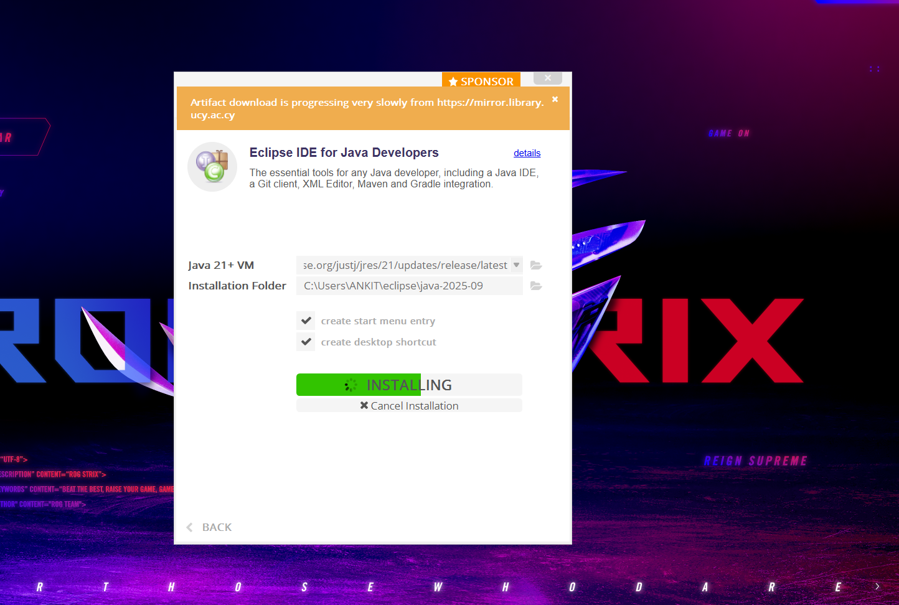

# Campus Course & Records Manager (CCRM)

## Project Overview
The **Campus Course & Records Manager (CCRM)** is a Java SE console-based application that helps an institute manage academic records.  
It provides menus and commands for **student management**, **course management**, **enrollments**, **grades**, **transcripts**, and **file utilities** like import/export and backups.

This project demonstrates:
- **Object-Oriented Programming** (Encapsulation, Inheritance, Abstraction, Polymorphism).  
- **Advanced Java** features: Streams, Enums, Exceptions, Date/Time API.  
- **Design Patterns**: Singleton (AppConfig), Builder (Course creation).  
- **File I/O** with NIO.2, recursive utilities, CSV import/export.  
- **CLI Menus** using switch/loops, exception handling, and custom validations.  

---

## ● Evolution of Java (short timeline)
- 1995 → Java 1.0 (first release, applets, AWT).  
- 1997 → Java 1.1 (inner classes, JavaBeans, JDBC).  
- 1998 → Java 2 (SE 1.2) – Swing, Collections, Plug-in.  
- 2002 → Java SE 1.4 – assert keyword, Exception chaining, NIO.  
- 2004 → Java SE 5.0 – Generics, Annotations, Autoboxing, Enhanced for loop.  
- 2006 → Java SE 6 – Performance boost, Scripting API.  
- 2011 → Java SE 7 – Try-with-resources, diamond operator, nio.2.  
- 2014 → Java SE 8 – Lambdas, Streams, new Date/Time API.  
- 2017 → Java SE 9 – Module system, JShell.  
- 2018 → Java SE 11 (LTS) – var, improved APIs.  
- 2021 → Java SE 17 (LTS) – Records, Sealed classes, Pattern matching.  
- 2023 → Java SE 21 (LTS) – Latest refinements, performance upgrades.  

---

## ● Java Editions: ME vs SE vs EE

| Edition | Purpose | Features | Platforms |
|---------|---------|----------|-----------|
| **Java ME** (Micro) | For embedded & IoT devices | CLDC, CDC, small runtime | IoT, feature phones |
| **Java SE** (Standard) | General-purpose apps | Core libraries, JDK tools, JVM | Desktop, laptops, servers |
| **Java EE** (Enterprise, Jakarta EE) | Enterprise apps | Servlets, JSP, JPA, JMS, CDI | App servers, enterprise backends |

---

## ● Java Architecture: JDK, JRE, JVM

- **JVM (Java Virtual Machine)** – Executes compiled bytecode (`.class` files).  
- **JRE (Java Runtime Environment)** – JVM + libraries to *run* Java apps.  
- **JDK (Java Development Kit)** – JRE + compiler (`javac`), debugger, dev tools.  

👉 **Flow**: Developer uses **JDK** to compile → **JRE** provides runtime → **JVM** executes.  

---

## ● Install & Configure Java on Windows

1. Download JDK (e.g., JDK 17).  
2. Run installer → select path (e.g., `C:\Program Files\Java\jdk-17`).  
     
3. Set environment variables:  
   - `JAVA_HOME` = path to JDK  
   - Add `%JAVA_HOME%\bin` to PATH  
4. Verify:  
   ```bash
   java -version
   javac -version
